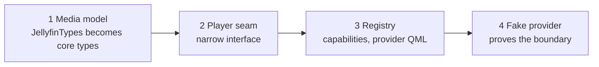

# Spool provider split plan

Last updated 2026-09-20. Living document: the plan doc is at
https://claude.ai/code/artifact/dfa7b95e-4398-4f8c-b373-77fd06bb6a67 and this
file is the copy that travels with the code.

## Decision

One Spool app, many providers, two repos. This repo stays `spool` and keeps core
and app together, the way Kodi's main repo holds the player, the skin engine and
the app. Only providers get their own repos: `spool-jellyfin` first, and a debrid
or Stremio-style provider later against the same contract. Users pick a provider
on first run and the app fetches it at runtime once each platform is proven, with
providers built in until then.

The boundary gets drawn in place first and proven with a throwaway second
provider. Nothing moves between repos until a fake provider runs with zero
changes to the UI layer. Core and app stay here as separate directories with a
public header boundary between them, so a separate `spool-core` can be extracted
by a directory move if a second app ever needs it. No repo rename.

What this rules out: two independent apps that each build on core. Browse,
details, search, player overlay, queue and settings are the same screens
regardless of where the bytes come from. Forking them recreates the
Jellyfin-client situation where every UI fix lands twice.

Also ruled out for now: a separate `spool-core` repo. With one app it would hold
about 3k lines of glue and branding, and every user-facing release would need a
core tag plus a pin bump in the app. Stremio splits core from shell because it
has four shells. Kodi has one app and does not split. Extract core the day a
second app or a community frontend actually exists.

## Status

Phases 1 to 4 are done on `refactor/provider-seam`. The tree builds, all 77
tests pass, and `tools/check-module-seam.sh --strict` reports no core file
including provider code. A folder-of-files provider runs every core screen with
no Jellyfin singletons registered. Phase 5 is next.

| Landed | What it is |
| --- | --- |
| Media model | `src/media/MediaTypes` replaces JellyfinTypes; AuthSession and DiscoveredServer moved provider-side |
| Player seam | `src/provider/PlaybackSource` is all the player sees; the X-Emby-Token header lives in the facade |
| Settings inversion | SettingsController emits, `JellyfinSettingsBridge` listens |
| Catalog contract | `Catalog`, `SearchSource`, `UserItemStateSink`, `ArtworkSource` interfaces; seven controllers and artwork moved to core |
| Registry | `Provider`, `ProviderRegistry`, `ProviderCapabilities` singleton driven from C++; `JellyfinProvider` composes everything Jellyfin-specific |
| QML gating | Every provider-specific control gated on `ProviderCapabilities`; Jellyfin-only QML under `qml/providers/jellyfin` |
| Seam check | `module-seam` ctest fails the build if core includes `src/api`, `src/discovery` or `src/providers` |
| Local provider | `src/providers/local` serves a folder of files; `--provider local --library-root DIR` selects it |

## Target layout

Two repos. This one keeps about 86% of the ~95k lines measured on `master` at
a69c8da.

| Repo | Holds | Lines |
| --- | --- | --- |
| `spool` (this repo) | Core: player engine, 10-foot UI kit, all screens, platform layer for 6 targets, settings, diagnostics, cache, artwork pipeline, provider contract, build and packaging for every target, the mpv submodule. App: composition root, branding, store metadata, icons, i18n, VERSION. Contract spec under `docs/contract/` | ~82k |
| `spool-jellyfin` | Jellyfin auth and login screens, server discovery, item queries, playback negotiation, session reporting, SyncPlay, remote control, playlist and collection management | ~13k |

**Why core and app stay together.** The app layer is about 3k lines:
AppController, main.cpp and the files a store or package manager cares about.
Almost everything that feels like "the app" is reusable: settings, router,
artwork loading, the content and browse models, the deep-link codec, the
Spool-to-Spool remote protocol. Those are core so the next provider gets them for
free, and what is left is too thin to be worth a release step of its own. It
lives in `apps/spool/` here, built only against core's public headers. If that
directory starts growing, core has leaked.

## The provider contract

A provider is a set of capabilities it opts into, not one fat backend interface.
A debrid provider implements the first three and nothing else. Jellyfin
implements all of them.

| Capability | What it covers | Required |
| --- | --- | --- |
| Catalog | Libraries, browse pages, filter options, details, seasons and episodes, resume, next up, latest, similar, by person | Yes |
| Stream | Resolve an item to something mpv can open, including media sources, tracks and bandwidth choice | Yes |
| Artwork | Image URLs for an item, trickplay tiles | Yes |
| Auth | Login flow and its screens, session persistence, credential store use, expiry | No |
| Discovery | Find servers on the LAN | No |
| Search | Text search and suggestions | No |
| User item state | Favourite, played, playback position | No |
| Playback reporting | Start, progress, stop, capabilities | No |
| Segments | Intro and credit markers for skip cards | No |
| Stream quality | Bitrate and height overrides, the quality ladder | No |
| Library management | Playlists, collections, rename, delete | No |
| SyncPlay | Group watch with a shared clock | No |
| Remote control | Cast to and control other sessions of the same backend | No |
| Peer relay | A datagram path between two Spool instances via the backend | No |

The player only needs Stream, Playback reporting and Segments. That is the whole
player-side seam and it is small.

**Shape of the code.** Core defines the capability interfaces and a registry. A
provider registers itself, declares which capabilities it serves, and supplies
its own QML for the screens only it needs (login, account linking, remote
targets). The same provider builds as a static library for bundling and as a
shared library for runtime download. Core screens ask the registry whether the
active provider has a capability and show or hide controls accordingly.

**The media model is core.** The structs in `src/media/MediaTypes.h`
(LibraryItem, MovieItem, MediaStreamInfo, MediaSourceInfo, PlaybackSession,
SubtitlePreferences, MediaSegment, TrickplayInfo and the rest) are what every
screen and the player consume. Fields that only Jellyfin has, like server and
session ids, become opaque provider handles. Library state that no server keeps,
which is the debrid case, lands in the existing cache tables, which are already
generic.

Fields still carrying Jellyfin's shape, left for a human decision: the
`mediaSourceId`, `playSessionId` and `playMethod` on PlaybackSession; the image
`*Tag` fields on MovieItem, LibraryItem and PersonItem; `playlistItemId`,
`locationType`, `isVirtualItem`, `recursiveItemCount`; every `*Ticks` field,
which is Jellyfin's 100 ns unit; the string enums on MediaStreamInfo and
MediaSegment; and MetaJson's PascalCase policy with its `RuntimeTicks` and
`ImageTag` key aliases.

## Provider picker and runtime download

Users pick a provider on first run and the app fetches it. Providers ship built
into the binary until each platform's download path is proven, so the picker
looks and behaves the same on day one and the download is a detail users never
notice. The mechanism is the same one Kodi uses for add-ons; the difference is a
curated list of first-party providers and no add-on browser.

**The picker.** A first-run screen listing first-party providers: Jellyfin now,
Stremio-style and debrid as they exist. Picking one runs that provider's login or
account-linking flow. Settings gets a "Change source" entry that returns to the
picker. One provider is active at a time. Aggregating several sources into one
home page is a real design problem and is out of scope.

**Sequencing.**

1. Picker with providers built in, static link.
2. Download path on Linux and Windows, where loading a fetched shared library
   just works.
3. macOS once downloaded plugins are signed with the team ID so library
   validation passes.
4. Android and webOS after the spike below.

| Platform | Runtime load | Blocker |
| --- | --- | --- |
| Linux | Works | None |
| Windows | Works | None |
| macOS | Works with signing | Hardened runtime library validation: plugins signed with the same team ID, or drop the entitlement |
| Android | Works technically | Google Play forbids downloading native code; fine while updates stay outside Play |
| webOS | Expected to work | Likely fine without root: Kodi loads add-on binaries on webOS and Spool already self-updates there. Confirm with a half-day spike |

**ABI-safe boundary.** A native plugin must match the app's Qt build, compiler
and struct layouts, so a stable logical API is not enough. The plugin interface
is pure virtual classes carrying an interface version integer, and item data
crosses it as QVariantMap or JSON, never as C++ structs. The app refuses a plugin
whose interface version differs from its own. Slightly slower than passing
structs, immune to layout changes.

**Lockstep release train.** This repo's release CI builds every first-party
provider for all 6 targets from the pinned submodules, with this repo's own
toolchain, and publishes the plugin binaries plus a provider index JSON with each
release. The app downloads from the index for its own version and platform.
Providers cannot drift from the app because the same job built both. A
provider-only workflow rebuilds providers against the current `spool` tag and
updates the index, so a Jellyfin fix ships without an app release. Provider repos
never run their own multi-platform builds.

**Fallback if webOS blocks native loading.** Providers as QML and JS bundles: no
ABI, no signing, no Play policy problem. The Jellyfin facade is mostly HTTP, JSON
and URL building, so it is about 3k lines of JS to write, with heavier pieces
like bandwidth policy and the SyncPlay clock kept in core as generic services.
Decide after the spike, not before.

## Phases 1 to 4: draw the boundary in place (done)

All of this happened in this repo with the app shipping normally throughout.

**Phase 0: rename, deferred.** The `JellyfinNative` namespace, the
`JellyfinWebOS` QML module, the `jellyfin-core` and `jellyfin-native` CMake
targets and the `qtfin` i18n prefix all name provider-agnostic code after
Jellyfin. The rename is cosmetic and touches every file, so it is folded into the
Phase 5 directory move, where every file moves anyway. Nothing depends on it.

**Phase 1: media model.** JellyfinTypes moved to `src/media/MediaTypes`, with
AuthSession and DiscoveredServer pushed provider-side. Fields unchanged; the
audit list is above.

**Phase 2: player seam.** PlayerController, PlayQueueController and
PlaybackReporter take a `PlaybackSource *`. The facade implements it. Nothing
under `src/player` includes anything from `src/api`. SettingsController lost the
facade and talks through `JellyfinSettingsBridge`. The platform layer reports
codec capabilities through a callback instead of taking the facade.

**Phase 3: provider registry.** `Provider` with capability flags, a
`ProviderRegistry`, and a `ProviderCapabilities` QML singleton driven from C++.
`JellyfinProvider` composes the facade, discovery, session, QuickConnect,
SyncPlay, remote control, library management and the settings bridge, and
registers its own QML singletons. Every provider-specific control in shared QML
is gated on a capability flag; Jellyfin-only QML lives under
`qml/providers/jellyfin`.

**Phase 4: fake provider.** `src/providers/local` serves a folder of media files
as one library. It forced six real core changes: the start route is chosen from
the Auth capability rather than always being login; AppController null-guards
SyncPlay and remote control; a provider with no sign-in emits `sessionStarted`
from storage restore; the quality picker became a capability; the series
audio-track cache key stopped assuming a server and user id; and Catalog and
PlaybackSource grew the libraries, filter options, items-by-ids, segments and
stream resolution that only AppController had been getting from the facade.

Done means: two providers build, the Jellyfin app is unchanged for users, and
core includes nothing from `src/api`, `src/discovery` or `src/providers`. The
`module-seam` ctest enforces it.

## Phases 5 to 7: split out the provider

One in-tree reshuffle, then one extraction, then a release. The app keeps
building at every step.

**Phase 5: in-tree directories that mirror the future repos.** Move code so this
repo's layout already looks like three repos in one, and fold the deferred rename
into the same pass.

| Directory | Becomes | Builds as |
| --- | --- | --- |
| `core/` (src, qml, tests, tools, cmake, packaging, mpv) | stays here | `spool-core` static library plus a `spool_add_app()` CMake function |
| `providers/jellyfin/` | `spool-jellyfin` | `spool-provider-jellyfin`, static for bundling and shared for download, only public core headers |
| `providers/local/` | stays here as the fixture | `spool-provider-local` |
| `apps/spool/` | stays here | The executable, via `spool_add_app()` |

The rule that makes the split safe: `providers/*` and `apps/*` may include only
headers core exports on purpose, from a `spool/` include prefix. If the Jellyfin
provider builds against core's public headers alone while sitting in the same
tree, extracting it is a directory move.

**Phase 6: extract the provider.** Create `spool-jellyfin` from
`providers/jellyfin/` with `git subtree split` so file history survives. It
consumes this repo as a git submodule pinned to a tag, the same way this repo
already consumes the mpv fork. Its CI builds the provider against that pin and
runs `tests/api` and `tests/discovery`.

This repo then consumes `spool-jellyfin` back as a submodule under `providers/`,
pinned to a tag. Release CI builds it for all 6 targets alongside the app,
bundles it into the binary, and publishes the plugin binaries and provider index
for the download path.

CI here keeps two app builds: the real `spool` with the Jellyfin pin, and the
local-fixture app that needs no external repo at all.

**Phase 7: first release.** Tag `spool` at the current user-facing version and
`spool-jellyfin` v1.0.0, with the pins matching. Users see no change.

After this the debrid provider starts as a third repo against a contract that
already has two real implementations and one fixture.

## How core is consumed

Pinned, not tracked at head. For a two-person team a core change needing a tag
before a provider can use it is a small tax, and it is far cheaper than a core
push breaking the app on a Tuesday.

| Repo | Depends on | How |
| --- | --- | --- |
| `spool` | mpv fork, `spool-jellyfin` | git submodules, pinned to tags, as today for mpv |
| `spool-jellyfin` | `spool` (core headers only) | git submodule, pinned to a tag |

Core uses semver on `spool`'s tags. A provider states the major it targets. The
provider's pin only serves its standalone CI: when built inside `spool` it
compiles against the checked-out core, and the semver major is the compatibility
promise. The existing submodule checks in `tools/` (flake sync, remote refs)
already cover this pattern for mpv and extend to the new pin with no new
machinery.

**Packaging lives in `core/` and nowhere else.** This is the biggest hidden cost
of a bad split, so it is a hard rule. Core exports one CMake entry point,
`spool_add_app(NAME ID ICONS PROVIDERS ...)`, that produces every target's
output: webOS ipk, Android apk, macOS dmg with signing and notarisation, Windows
installer, AppImage, Arch package. `apps/spool/` supplies `appinfo.json.in`, the
desktop and metainfo files, icons, VERSION and the open source notices, and calls
that function. The flake, `build-ipk.sh`, the scripts under `tools/`, and the
GitHub workflows all move under `core/` and stay callable from any app directory.
Renovate stays in each repo for its own pins.

Release flow for a normal user-facing change is unchanged from today: fix, tag,
release. For a Jellyfin-only fix: fix in `spool-jellyfin`, tag, bump the pin here,
and run the provider-only workflow to publish new plugin binaries against the
current `spool` tag. Once the download path is live on a platform, that needs no
app release. The version users see is this repo's VERSION file.

## Where the tests go

About 10.7k of the 12.5k test lines follow core. Only `tests/app` splits down the
middle.

| Suite | Goes to | Notes |
| --- | --- | --- |
| tests/qml | core | Primitives, shell, navigation, provider gating |
| tests/player | core | Uses the PlaybackSource interface with a stub |
| tests/app (core half) | core | ContentModel, SettingsSchema, SettingsController, Router, UpdateManifest, SpoolLink, SpoolRemoteProtocol, ArtworkUrl, ProviderRegistry |
| tests/common, cache, platform, diagnostics, tools | core | MetaJsonTest's Jellyfin parsing cases move with the parser |
| tests/providers | core | The local fixture; the permanent contract test |
| tests/api, tests/discovery | jellyfin | Untouched |
| tests/app (provider half) | jellyfin | SyncPlay drift, clock, queue handoff, Session, RemoteControl, BrowseSession, LibraryQuery |
| tests/media (ffmpeg compliance) | core | Belongs with the player |

Core gets contract tests that run against every registered provider, starting
with the local fixture, so a provider that claims a capability has to pass them.
The Jellyfin provider runs those same contract tests against a recorded server in
its own CI. The test runner and TestMain stay in core and get exported alongside
`spool_add_app()`, so providers do not each grow their own harness.

## What will bite

- **The rename touches every file.** ~300 files name the namespace, the QML
  module or the CMake targets. Land it in a quiet window with no large branches
  open, and rebase anything outstanding the same day.
- **SyncPlay and remote control reach deep into the player.** The player exposes
  sync playback speed and the queue outline for SyncPlay's benefit. Those stay as
  generic player hooks; only the controller that drives them is provider-side.
- **SpoolLink relays through the Jellyfin server.** The peer link is a core
  feature but its only transport today is provider-owned. Design it so a provider
  without a relay reports the capability as absent.
- **Runtime plugins are an ABI contract, not an API one.** A Qt patch bump or a
  new struct field breaks every downloaded provider unless data crosses the
  boundary as QVariant or JSON and the interface is versioned. Build the boundary
  that way before any plugin is ever downloaded, and never let a provider repo
  build its own binaries.
- **Do not extract a `spool-common` repo.** Shared-utility repos become dumping
  grounds and a coordination tax on every change. Each layer keeps its own
  helpers and tolerates a little duplication.
- **Do not start the debrid provider early.** It is the reward for finishing, not
  a way to test the contract. The local fixture is the test.

Rules while this is in flight:

1. `master` builds and ships at every commit. No long-lived split branch.
2. New code lands on the correct side of the line. Anything Jellyfin-specific
   goes under `src/api` or a provider directory, never into player, shell or
   primitives.
3. Provider-specific controls in core QML are gated on a capability flag.
4. The fake provider is not deleted. It is the contract's regression test
   forever.

Known loose ends from Phase 4:

- `SearchController` and `UserItemStateController` take their interfaces
  unguarded, so a provider lacking those capabilities would crash rather than
  degrade.
- Remote command payloads crossing `RemotePlayback` still carry Jellyfin's JSON
  envelope.
- `settingsSchema` is a CONSTANT QML property, so switching provider at runtime
  would not refresh the account rows. Fine while the provider is fixed at
  startup.

Open questions:

- [ ] webOS spike: can the jailed app load a downloaded shared library?
- [ ] macOS: sign downloaded plugins with the team ID, or drop library
      validation?
- [ ] Who owns the media model field audit?
